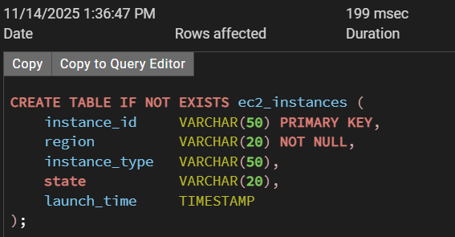
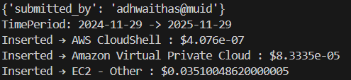
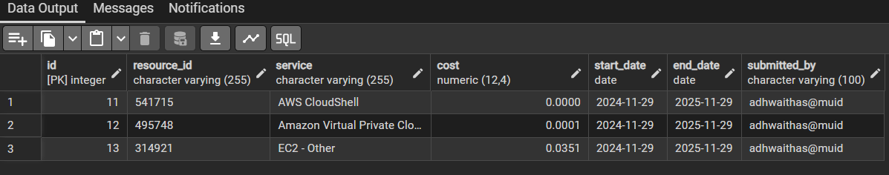

# Cost Tracker - Resource Expense Hunt

Track AWS daily service-level costs and store the aggregated values in a PostgreSQL database.
This script pulls **UnblendedCost**, grouped by **SERVICE**, over the last 12 months — then inserts the results into your `aws_cost_data` table.

---

## 🛠 Features

* Fetches AWS Cost Explorer data for **past 365 days**
* Groups cost by AWS **SERVICE**
* Stores aggregated cost in a **PostgreSQL** database
* Adds metadata fields such as `resource_id`, `submitted_by`, and date range
* Fully automated + ready for cron job scheduling

---

## 📦 Project Structure

```
.
├── main.py       # your main Python script
├── .env                 # environment variables (DB creds)
└── README.md
```

---

## 📸 Screenshots

### 🔹 Database Schema



---

### 🔹 Script Output




---

### 2️⃣ **Environment Variables (`.env`)**

Create a `.env` file:

```env
PG_HOST=localhost
PG_PORT=5432
PG_USER=postgres
PG_PASSWORD=yourpassword
PG_DATABASE=aws_costs
```

---

### 3️⃣ **Install Dependencies**

```bash
pip install boto3 psycopg2 python-dotenv
```

---

### 4️⃣ **PostgreSQL Table**

Create this table:

```sql
CREATE TABLE aws_cost_data (
    id SERIAL PRIMARY KEY,
    resource_id BIGINT,
    service TEXT,
    cost NUMERIC(12,2),
    start_date DATE,
    end_date DATE,
    submitted_by TEXT,
    created_at TIMESTAMP DEFAULT CURRENT_TIMESTAMP
);
```

---

## ▶️ Running the Script

```bash
python main.py
```

---

## 📄 Example Output (Console)

```
TimePeriod: 2024-11-29 -> 2025-11-29
Inserted → Amazon EC2 : $123.45
Inserted → Amazon S3 : $64.12
Inserted → AWS Lambda : $3.29
```

---

## 🗄 Example Query (PostgreSQL)

```sql
SELECT * from aws_cost_data;

```
