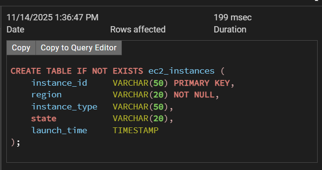
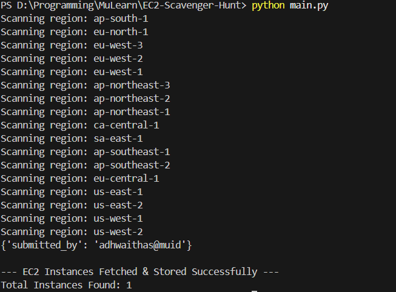
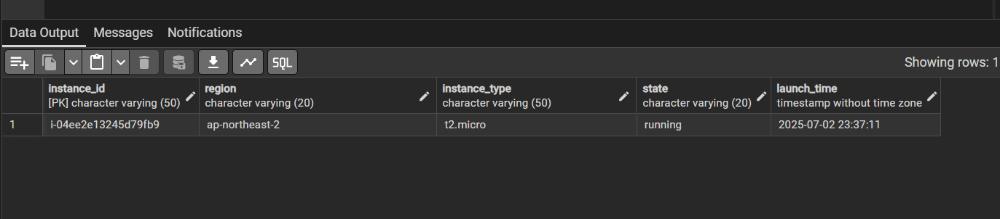

# 📦 EC2 Scavenger Hunt

*Fetch and store AWS EC2 instance details across all regions into a PostgreSQL database.*

---

## 🚀 Overview

This project uses boto3 to scan AWS for EC2 instances and psycopg2 to store metadata in PostgreSQL.
It is ideal for inventory management, cloud audits, and DevOps automation.

Use this to build:

* 🧭 Cloud inventory system
* 🔍 Compliance auditing
* 📊 Infrastructure reporting
* 🛡 Security monitoring

---

## 📸 Screenshots

### 🔹 Database Schema



---

### 🔹 Script Output




---

## 🛠 Features

* 🔍 Scan AWS resources across **all regions**
* ☁️ Supports EC2, S3, and Lambda (extendable)
* 🗂 Saves metadata into PostgreSQL (`ec2_instance` table)
* 🔑 Uses `.env` for secure credentials
* 🐘 Compatible with local PostgreSQL or Docker Postgres

---

## 📄 PostgreSQL Table Schema

```sql
CREATE TABLE IF NOT EXISTS ec2_instances (
    instance_id     VARCHAR(50) PRIMARY KEY,
    region          VARCHAR(20) NOT NULL,
    instance_type   VARCHAR(50),
    state           VARCHAR(20),
    launch_time     TIMESTAMP
);
```

---

## 🔧 Installation & Setup

### 1️⃣ Clone this repository

```bash
git clone https://github.com/AdhwaithAS/MuLearn.git
cd Resource-Recon-AWS-Inventory-Sweep
```

### 2️⃣ Install dependencies

```bash
pip install boto3 dotenv psycopg2
```

### 3️⃣ Create a `.env` file

```
AWS_ACCESS_KEY_ID=your_key
AWS_SECRET_ACCESS_KEY=your_secret
AWS_DEFAULT_REGION=ap-south-1

PG_HOST=localhost
PG_PORT=5432
PG_USER=postgres
PG_PASSWORD=yourpassword
PG_DATABASE=aws_inventory
```

---

## ▶️ Running the Recon Script

```bash
python main.py
```

Output will show per-region scanning status.

---

## 💾 Data Stored in PostgreSQL

Every discovered AWS resource is saved with:

| Column        | Description                |
| ------------- | -------------------------- |
| instance_id   | AWS instance id            |
| region        | AWS region                 |
| instance_type | Instance type              |
| launch_time   | Timestamp                  |
| state         | running or not             |

---
