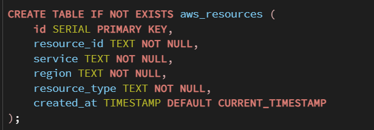
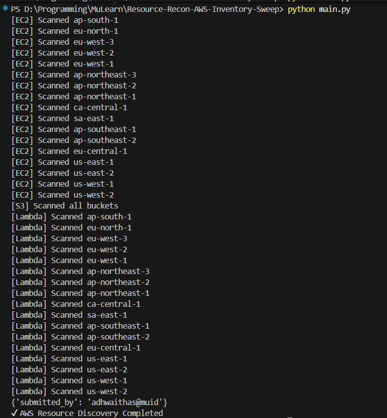
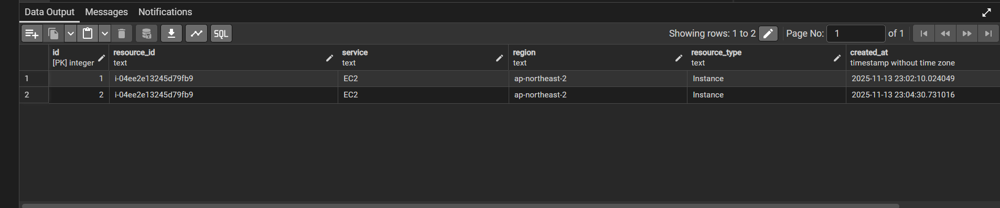

# 📦 Resource Recon AWS Inventory Sweep

*Automated discovery of AWS resources across all regions with metadata storage in PostgreSQL*

---

## 🚀 Overview

This project performs **cross-region reconnaissance** on your AWS account using `boto3`.
It scans for resources across multiple AWS services (EC2, S3, Lambda, etc.) and stores metadata in a PostgreSQL database.

Use this to build:

* 🧭 Cloud inventory system
* 🔍 Compliance auditing
* 📊 Infrastructure reporting
* 🛡 Security monitoring

---

## 📸 Screenshots

### 🔹 Database Schema



---

### 🔹 Script Output




---

## 🛠 Features

* 🔍 Scan AWS resources across **all regions**
* ☁️ Supports EC2, S3, and Lambda (extendable)
* 🗂 Saves metadata into PostgreSQL (`aws_resources` table)
* 🔑 Uses `.env` for secure credentials
* 🐘 Compatible with local PostgreSQL or Docker Postgres

---

## 📄 PostgreSQL Table Schema

```sql
CREATE TABLE aws_resources (
    id SERIAL PRIMARY KEY,
    resource_id TEXT NOT NULL,
    service TEXT NOT NULL,
    region TEXT NOT NULL,
    resource_type TEXT NOT NULL,
    created_at TIMESTAMP DEFAULT CURRENT_TIMESTAMP
);
```

---

## 🔧 Installation & Setup

### 1️⃣ Clone this repository

```bash
git clone https://github.com/your-username/aws-recon.git
cd aws-recon
```

### 2️⃣ Install dependencies

```bash
pip install boto3 dotenv psycopg2
```

### 3️⃣ Create a `.env` file

```
AWS_ACCESS_KEY_ID=your_key
AWS_SECRET_ACCESS_KEY=your_secret
AWS_DEFAULT_REGION=ap-south-1

PG_HOST=localhost
PG_PORT=5432
PG_USER=postgres
PG_PASSWORD=yourpassword
PG_DATABASE=aws_inventory
```

---

## ▶️ Running the Recon Script

```bash
python main.py
```

Output will show per-region scanning status.

---

## 💾 Data Stored in PostgreSQL

Every discovered AWS resource is saved with:

| Column        | Description                |
| ------------- | -------------------------- |
| resource_id   | AWS resource identifier    |
| service       | EC2 / S3 / Lambda          |
| region        | AWS region                 |
| resource_type | Instance, Bucket, Function |
| created_at    | Timestamp                  |

---

