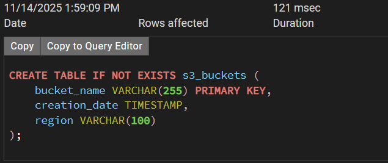
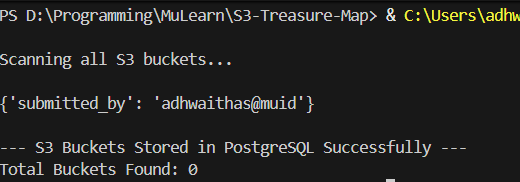
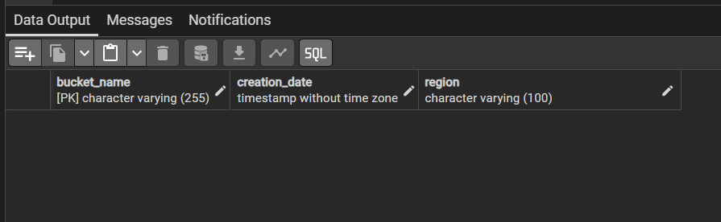

# 📦 S3 Treasure Map

*Map out all AWS S3 buckets and store their metadata in a PostgreSQL database.*

---

## 🚀 Overview

list every S3 bucket in your AWS account and capture key details such as bucket name, creation date, and region. Store all collected metadata in a structured PostgreSQL table for centralized visibility and resource tracking.

Use this to build:

* 🧭 Cloud inventory system
* 🔍 Compliance auditing
* 📊 Infrastructure reporting
* 🛡 Security monitoring

---

## 📸 Screenshots

### 🔹 Database Schema



---

### 🔹 Script Output




---

## 🛠 Features

* 🔍 Scan AWS resources across **all regions**
* ☁️ Supports EC2, S3, and Lambda (extendable)
* 🗂 Saves metadata into PostgreSQL (`s3_buckets` table)
* 🔑 Uses `.env` for secure credentials
* 🐘 Compatible with local PostgreSQL or Docker Postgres

---

## 📄 PostgreSQL Table Schema

```sql
CREATE TABLE IF NOT EXISTS s3_buckets (
    bucket_name VARCHAR(255) PRIMARY KEY,
    creation_date TIMESTAMP,
    region VARCHAR(100)
);

```

---

## 🔧 Installation & Setup

### 1️⃣ Clone this repository

```bash
git clone https://github.com/AdhwaithAS/MuLearn.git
cd S3-Tresure-Map
```

### 2️⃣ Install dependencies

```bash
pip install boto3 dotenv psycopg2
```

### 3️⃣ Create a `.env` file

```
AWS_ACCESS_KEY_ID=your_key
AWS_SECRET_ACCESS_KEY=your_secret
AWS_DEFAULT_REGION=ap-south-1

PG_HOST=localhost
PG_PORT=5432
PG_USER=postgres
PG_PASSWORD=yourpassword
PG_DATABASE=aws_inventory
```

---

## ▶️ Running the Recon Script

```bash
python main.py
```

Output will show per-region scanning status.

---

## 💾 Data Stored in PostgreSQL

Every discovered AWS resource is saved with:

| Column        | Description                |
| ------------- | -------------------------- |
| bucket_name   | AWS bucket name            |
| creation_date | Timestamp                  |
| region        | AWS region                 |

---

